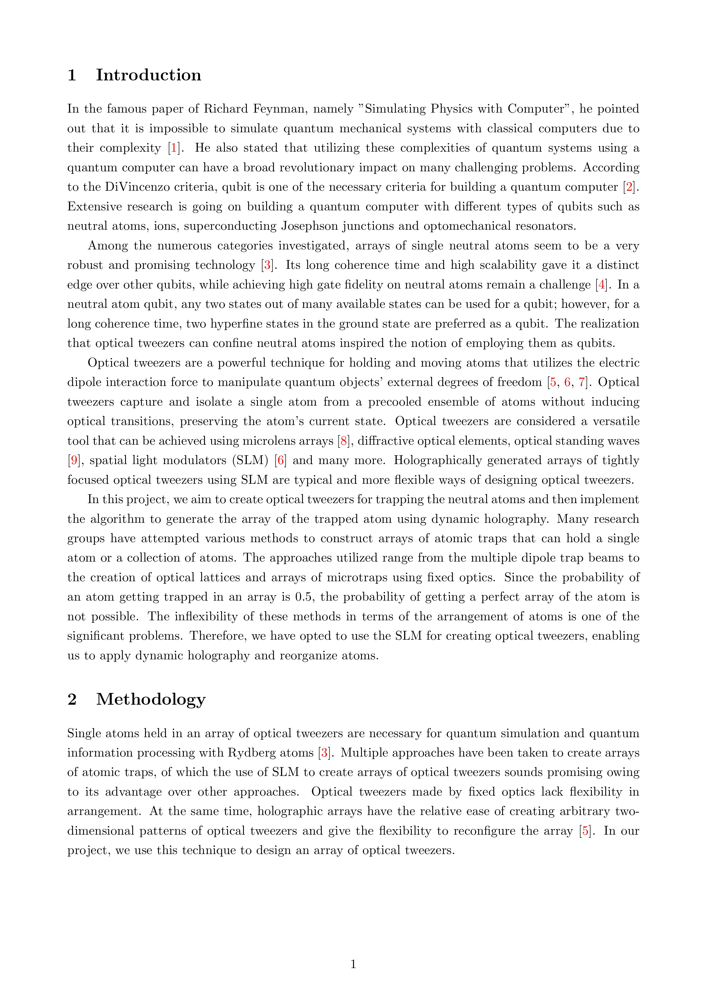

# Design and characterization of arrays of optical tweezers for single atom trapping
This project aims to design optical tweezers for capturing single neutral atoms, a crucial component for quantum computing. By utilizing a liquid-crystal spatial light modulator and the using Gerchberg-Saxton algorithm for generation of required phase pattern, the team has successfully developed the optical setup and demonstrated the generation of optical tweezers capable of capturing atoms. We have developed the optical setup and demonstrated the generation of optical tweezers for capturing of the atoms. We have also developed the routine to construct a defect free array of atoms via transportation of atom to the vacant sites from reservior sites. The next move is to do modification for flicker free movement of optical tweezers.

More detail can be found in [Project Report file](https://github.com/mayanddangi/BTP_Optical-Tweezers/blob/main/Project%20Report.pdf).

## Project Report

